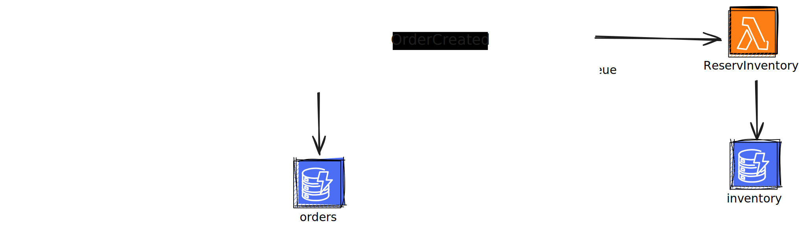

## Ideas
- [ ] Secure API gateway with API key/JWT/...
- [ ] Add CI/CD using GH Actions
- [x] Add system architecture diagram
- [ ] Consistently name Makefile targets
- [ ] Research scalable mono-repo terraform files organization ([Anton Pura](https://www.youtube.com/watch?v=nMVXs8VnrF4), [Infinum DevOps](https://github.com/infinum/infrastructure-template/blob/main/terraform/README.md))
- [ ] Move tfstate to remote backend ([idea](https://github.com/infinum/infrastructure-template/blob/main/terraform/init/AWS/README.md))
- [x] Add Git hooks for linting
- [x] Document setup
- [ ] Extract common service logic into reusable package

## System architecture diagram


## Project setup
Configures env var manager ([direnv](https://direnv.net/)) and git hooks manager([pre-commit](https://pre-commit.com/))
```bash
make setup
```

## Terraform AWS authentication
AWS provider authentication is done through environment variables. Check [AWS docs](https://docs.aws.amazon.com/cli/v1/userguide/cli-configure-envvars.html) for more details on available options.

## Infrastructure management
Show infra execution plan for platform and all services. Note it might not work for if dependant state is not up-to-date for interconnected services.
```bash
make plan
```

Apply infra plan for platform and all services.
```bash
make apply
```

Remove infra resources for platform and all services.
```bash
make destroy
```
